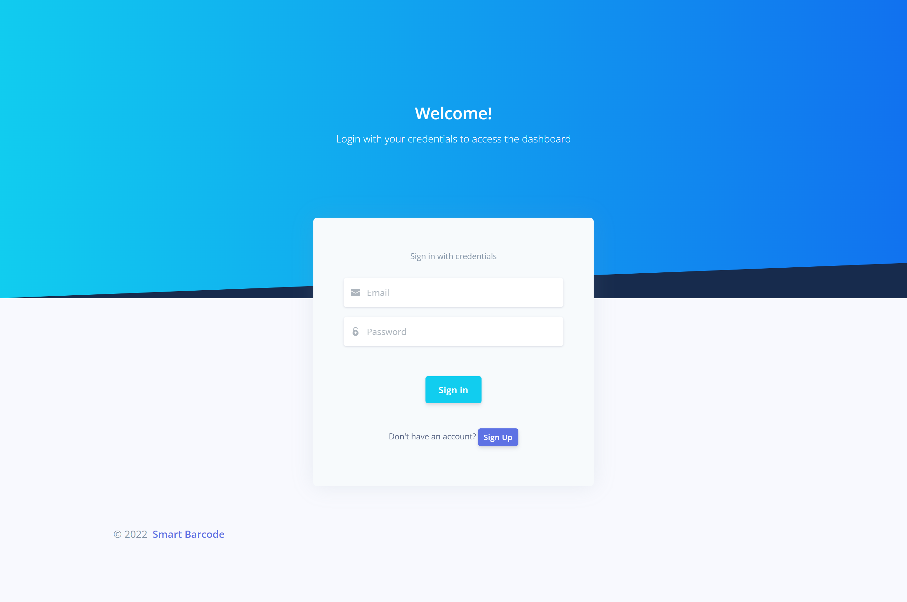
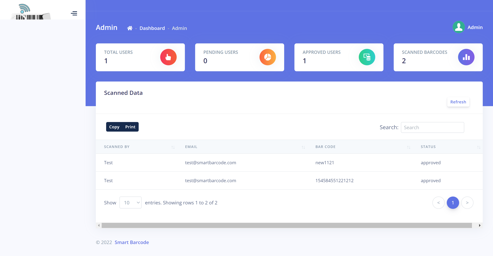
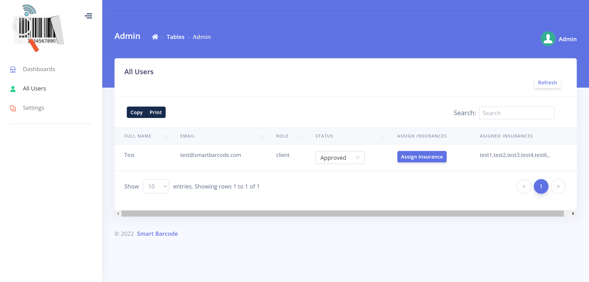
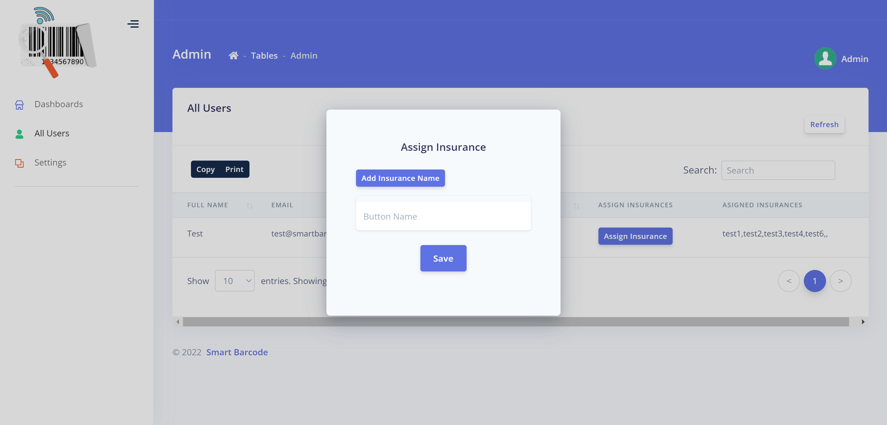
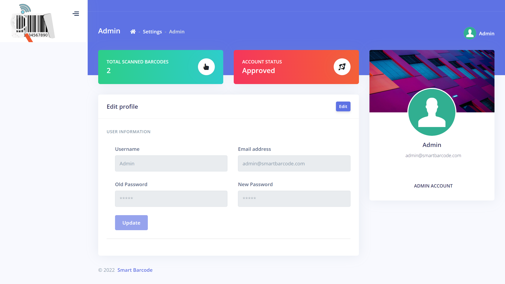
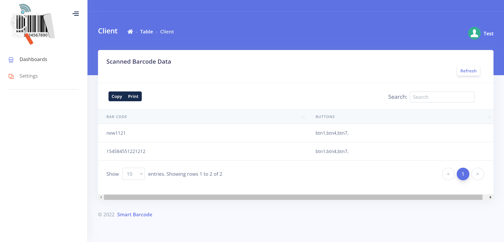
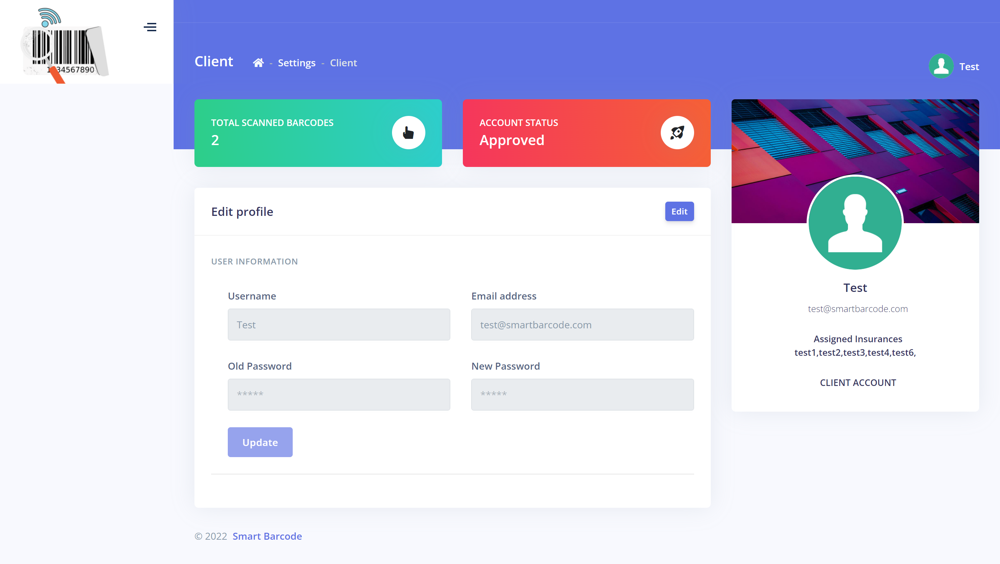

  

<h3 align="center">Smart Barcode Scanner</h3>

---

 Smart Barcode Scanner
      

# 📝 Table of Contents

- [About](#about)
- [Smart Socket](#sfms)
  - [Getting Started](#getting_started)
  - [Circuit](#circuit)
  - [WebApp](#webapp)
  - [Usage](#usage)
  - [Demo Videos](#video)
  - [List Of Components](#list)
  - [Built Using](#built_using)
  - [Authors](#authors)

# 📜 About 

This repo contains

- Backend
- Firmware
- Detailed instructions

  

#   Smart Barcode Scanner
## Getting Started 

These instructions will get you a copy of the project up and running on your system.

### Prerequisites

### Installing 

## 💻WebApp 

WebApp can be accessed from the link below

https://smart-barcode-webapp.production.rehanshakir.com/ 

Admin Account: admin@smartbarcode.com
Password: admin123456
Client Account: test@smartbarcode.com
Password: test123456

### FrontEnd

-   The WebApp is developed using NodeJS, ReactJS and MongoDB.

-   Link: [Complete Dashboard](https://smart-barcode-webapp.production.rehanshakir.com/ )
    *   user: admin@smartbarcode.com
    *   pass: admin123456

 Sign-in Page / Sign-up Page

 Dashboard Home Page(Admin)

 Users Access Page

 Insurance Assignment Page

 Admin Profile Page

 Client Dashboard

 Client Profile Page

### Database

You can access the database from the link below

**TO BE ADDED**
<!-- 
*   http://Smart Barcode Scanner-data-preview.production.rehanshakir.com/
    *   User: admin
    *   Password: admin

 Database -->

# Usage 

# Demo Videos 

- [WebApp](https://youtu.be/_Q1-vhzjxG8) - WebApp Demo Video

# ⛏️ Built Using 

- [Arduino](https://www.arduino.cc/) - Embedded Framework and IDE - For Sensor Node Design

# ✍️ Authors 

- [@Nauman3S](https://github.com/Nauman3S) - Development and Deployment
